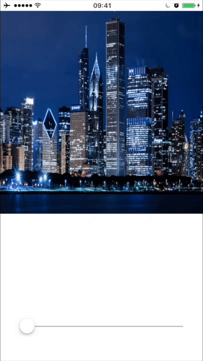

# Async Blur
## Easiest way to blur images on iOS. 

Async blur provides api for blurring images and perform some optimizations inside.



## Optimizations:
- use own queue with background priority for render 
- use `vImageTentConvolve` from `AccelerateKit` for blur. It's extremely fast!
- downscale image to size of passed image view or to size of screen before blur
- check blur operations in queue and delete unnecessary. You can use AsyncBlur for progress blur render. 

## There are two ways to use it:

### ABImageView

Just modify `.blurRadius` property.

```
ABImageView *imageView = [[ABImageView alloc] initWithImage:[UIImage imageNamed:@"example"]];
imageView.blurRadius = 10;
```

### ABManager

Can be used if you need blurred UIImage.

```
__weak typeof(self) wSelf = self;
[ABManager renderBlurForImage:image forImageView:self.backgroundImageView radius:blurRadius withCallback:^(UIImage *blurredImage) {
    typeof(self) sSelf = self;
    self.backgroundImageView.image = blurredImage;
    self.otherImageView.image = blurredImage;
}];
```

## Author

Vladislav Dugnist, vdugnist@gmail.com

## License

AsyncBlur is available under the MIT license.
